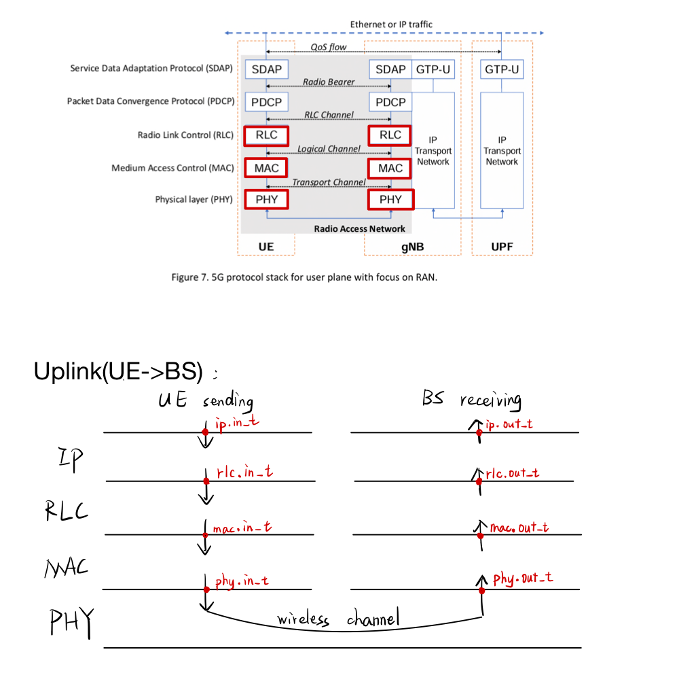

## Visualization

Using the code in [meas-visualization](https://github.com/gourav-prateek-sharma/meas-visualization).

Generally the packet transmission could be like:


- About the data:

    - sched.json:   stands for scheduling, from gNB side, containing the time to decide and give UE schedule
    - sr_tx:        stands for scheduling request, from UE side, contains the time to request gNB for a schedule
    
        scheduling: UE: ask to send, BS: tell UE "you are allowed to send in this TBS ..."
    
    - bsr:          stands for buffer status report, where UE tells gNB how much data is buffered, using the header of packets
    - mcs:          stands for modulation and coding scheme
    - packets:      all packets

- Some Acronym:
    - sn:       serial number (of the ip layer packets)
    - so:       segment offset (of the rlc segments from the upperlayer ip packet)

        so + len shows the order of segments,
        For example in ```/s24/pakcets.json```, the ip packet with ```sn=0``` is segmented, 
        where segments are inside ```rlc.attempts```:
        The 1st segment has ```so=0``` and ```len=16```,
        the 2nd segment as ```so=16``` and ```len=14```
        the 3rd segment as ```so=30``` 
        ......

    - id:       id of the mac packet from the upperlayer rlc packet
    - rlc:      radio link control
    - sr:       scheduling request
    - bsr:      buffer status report
    - mcs:      modulation and coding scheme
    - sched:    scheduling

